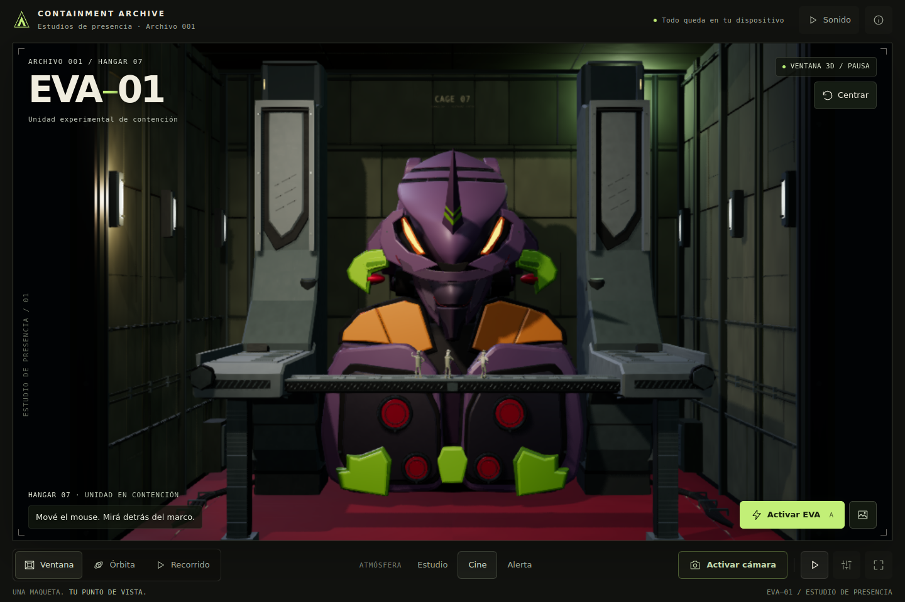

# EVA–01 · Containment Archive

Diorama interactivo de EVA–01 en su hangar, con tres operarios articulados, materiales procedurales, iluminación ajustable y controles de ventana, órbita y recorrido. La aplicación se distribuye como un único **[`index.html`](index.html) autocontenido**, que incluye el motor, el detector facial y los recursos necesarios para funcionar sin conexión.

La escena es una interpretación procedural de las referencias. Los personajes tienen trabajos diferenciados y responden a la activación simulada de EVA; sus pies permanecen apoyados en la plataforma y sus manos siguen los accesorios del rig. El movimiento de la interfaz confirma acciones y estados reales, con alternativas reducidas y cancelación inmediata.



## Abrir la aplicación

1. Descargá `index.html` y abrilo directamente en un navegador con **WebGPU o WebGL 2**.
2. Elegí **Explorar** para usar el mouse, el teclado o el tacto. La cámara y el sonido se activan sólo si los elegís.
3. Abrí **Ajustes** para cambiar calidad, iluminación, exposición y sensibilidad. **Guía** contiene las instrucciones dentro de la propia aplicación.

El HTML descargado no necesita `npm`, un servidor, un CDN ni acceso a internet. Si el navegador o una vista previa restringe la cámara en archivos locales, también podés servir la carpeta desde tu equipo:

```sh
python3 -m http.server 8000 --bind 127.0.0.1
```

Abrí [http://localhost:8000](http://localhost:8000). El servidor es local; la escena sigue sin descargar recursos externos.

## Vistas y controles

| Control | Comportamiento |
|---|---|
| **Ventana** | Mover el mouse o arrastrar con un dedo cambia el punto de observación detrás del marco. La rueda permite acercarse o alejarse. |
| **Órbita** | Arrastrar gira alrededor de la maqueta; rueda o pellizco cambian la distancia. |
| **Recorrido** | Mueve automáticamente el punto de vista por el hangar. |
| **Activar cámara** | Solicita permiso y muestra la guía de seguimiento. Al encontrar el rostro, **Centrar y entrar** calibra la posición. |
| **Centrar** | Restablece la vista o calibra el rostro cuando hay seguimiento disponible. |
| **Activar EVA** | Inicia la secuencia de activación simulada y la respuesta de los tres operarios. |
| **Pausa / Continuar** | Detiene o reanuda el tiempo de la escena; permite seguir encuadrando a mano. |
| **Estudio / Cine / Alerta** | Cambia el ambiente de iluminación. Alerta utiliza una iluminación estable, sin estroboscopía. |
| **Captura** | Guarda un PNG del diorama, sin los controles de la interfaz. |
| **Inmersión** | Amplía la escena y oculta parte de la interfaz; utiliza pantalla completa cuando el navegador lo permite. |

### Teclado

| Tecla | Acción |
|---|---|
| Flechas, con el diorama enfocado | Desplazar la vista o girar en Órbita |
| `+` / `−`, `PageUp` / `PageDown` | Acercarse o alejarse con el diorama enfocado |
| `R` | Centrar vista y rostro |
| `C` | Activar o apagar cámara |
| `A` | Activar EVA |
| `Espacio` | Pausar o continuar, fuera de un control nativo |
| `F` | Entrar o salir de inmersión |
| `H` | Abrir la guía; volver a pulsar para cerrarla |
| `Escape` | Cerrar el panel activo, salir de inmersión o descartar la bienvenida |
| `Tab` / `Shift+Tab` | Recorrer los controles; dentro de un diálogo, el foco permanece en él |

### Los tres operarios

| Personaje | Trabajo | Respuesta a la activación |
|---|---|---|
| **Coordinadora** (`coordinator`) | Observa la unidad y realiza una señal de autorización | Orienta el torso hacia EVA y mantiene el gesto de autorización |
| **Ingeniero** (`engineer`) | Sostiene, lee y toca una tableta; comprueba el estado de EVA | Interrumpe los toques, baja ligeramente la tableta y levanta la mirada |
| **Técnica** (`technician`) | Lee y ajusta un instrumento de inspección | Conserva el instrumento y dirige la atención hacia EVA |

Comparten geometría corporal y usan esqueletos independientes. La animación se actualiza desde el reloj común de la aplicación; cada personaje conserva su posición en la plataforma. Los contratos de articulación, contacto y pausa están en [Animación de los operarios](docs/crew-animation.md).

## Calidad y fotografía

**Automática** selecciona un punto de partida según las capacidades observadas. Hay cinco perfiles explícitos:

| Perfil | Uso y presupuesto |
|---|---|
| **Rendimiento** | Menor resolución, sombras y cantidad de polvo; bloom y oclusión ambiental desactivados |
| **Equilibrada** | Más detalle de imagen y bloom, con un presupuesto intermedio |
| **Calidad** | Mayor resolución e incorporación de oclusión ambiental cuando el backend lo admite |
| **Ultra** | Presupuestos superiores de resolución y sombras para inspección detallada |
| **Cinemática / Foto** | Pausa la escena para encuadrar y capturar con un presupuesto de imagen superior |

La adaptación de resolución, cuando está habilitada, reduce primero la cantidad de píxeles. Con carga sostenida puede retirar efectos opcionales; la recuperación utiliza esperas e histéresis para evitar cambios continuos. Los límites de textura, la pantalla y la disponibilidad del backend también acotan cada perfil. Los nombres de calidad describen presupuestos de la aplicación: el rendimiento depende del equipo y no se garantiza una tasa de FPS.

Para una fotografía, seleccioná **Ajustes → Calidad → Cinemática / Foto**, encuadrá y pulsá **Captura**. Se exporta un PNG de un fotograma con mayor resolución espacial cuando los límites lo permiten. La captura conserva la pose; al terminar se reaplican las dimensiones y la calidad vigentes. Al salir de ese perfil se recupera el estado de pausa anterior, respetando la preferencia de movimiento reducido. Esta exportación no utiliza acumulación temporal ni síntesis de fotogramas.

Los parámetros exactos y la selección de efectos están en [`src/quality.js`](src/quality.js) y [Decisiones gráficas](docs/graphics-decisions.md).

## Movimiento reducido, cámara y privacidad

La aplicación respeta `prefers-reduced-motion` al iniciar y cuando cambia durante la sesión. La preferencia pausa la escena, presenta los estados de la interfaz directamente y cancela las transiciones pendientes. La activación simulada resuelve su resultado con texto, sin exigir una secuencia animada. Se puede seguir explorando con entradas manuales.

**Continuar** permite autorizar explícitamente el movimiento de la escena. Las transiciones de la interfaz permanecen reducidas y el polvo sigue oculto mientras el sistema solicite reducción. Una escena pausada y asentada se dibuja bajo demanda, sin mantener un bucle de animación por personaje.

La cámara es opcional. El detector incluido procesa el video en el dispositivo, sin grabarlo, reconocer identidades ni enviarlo a un servidor. Estima el centro y el tamaño aparente del rostro; la distancia resultante es aproximada. Podés apagarla en cualquier momento. Cambiar a Órbita/Recorrido o abandonar la pestaña detiene su uso. Si se deniega el permiso, los otros controles siguen disponibles. El sonido también requiere una acción explícita. Las preferencias se guardan localmente cuando el navegador lo permite.

El documento final no solicita recursos de red y declara `connect-src 'none'`. La instalación de dependencias para desarrollar o reconstruir el proyecto es una operación separada que sí puede requerir conexión. El contrato del seguimiento está en [`src/tracker.js`](src/tracker.js).

## Renderizado y compatibilidad

La aplicación incluye una ruta real de **`WebGPURenderer` con un pipeline TSL** y una ruta de respaldo **WebGL 2**. Detecta capacidades e intenta inicializar WebGPU. Si esa ruta no puede preparar el dispositivo o la escena, recrea el canvas e inicia WebGL 2; la interfaz se conecta al canvas que queda activo.

Ambas rutas utilizan materiales PBR, iluminación lineal, tone mapping ACES y salida sRGB. La disponibilidad de HDR interno, antialiasing, bloom y oclusión ambiental depende del backend y de sus capacidades. **Ajustes → Estado y tecnología** muestra la ruta utilizada, los efectos efectivos y las métricas disponibles. Un campo GPU sin medición válida no se sustituye por un número inferido de los intervalos entre frames.

El entorno de verificación disponible utiliza **Chromium 134 con SwiftShader**, un renderer por software. En ese entorno, WebGPU nativo presentó pérdida del dispositivo incluso en una operación mínima. La ruta WebGPU está implementada, pero ese entorno no acredita su validación visual nativa. Las comprobaciones de WebGL 2, del código y de los contratos se registran por separado. Las muestras de SwiftShader no permiten prometer rendimiento, temperatura, memoria gráfica ni estabilidad en una GPU física o un móvil.

La selección de técnicas está documentada: [Decisiones gráficas](docs/graphics-decisions.md) contiene **61 decisiones** y **201 filas de trazabilidad (§0–200)**; [Movimiento semántico](docs/motion-design.md) evalúa las **16 técnicas** solicitadas. Las técnicas adoptadas, adaptadas y omitidas se identifican expresamente. La cobertura del análisis no significa que se hayan activado todos los efectos del mandato.

## Desarrollo y pruebas

Desde la raíz del repositorio, con Node.js y npm instalados:

```sh
npm ci
npm run build
```

El build combina [`shell.html`](shell.html), los módulos y los estilos de movimiento para regenerar `index.html`. Las dependencias están fijadas en `package-lock.json`. Para cambiar la aplicación, editá las fuentes y reconstruí el HTML.

Pruebas de contratos y módulos:

```sh
npm test
```

Auditoría de navegador mediante Playwright:

```sh
npm run test:browser
```

Si no tenés instalado el navegador de Playwright, podés instalar Chromium con `npx playwright install chromium`. También podés indicar un ejecutable ya disponible mediante la variable opcional `EVA_BROWSER_EXECUTABLE`:

```sh
EVA_BROWSER_EXECUTABLE=/ruta/a/chromium npm run test:browser
```

Los escenarios de recuperación tardía y pérdida del dispositivo se verifican también con fallos controlados:

```sh
npm run test:lifecycle
```

Esta suite ejecuta WebGL 2 real y sustituye la identidad del backend en un bundle temporal para recorrer las ramas de recuperación de WebGPU. Verifica el estado de pausa, el cierre de diálogos y el acceso al botón de reinicio; no acredita renderizado WebGPU nativo. La instrumentación queda fuera del HTML de entrega. Las dos suites de navegador admiten `EVA_SOFTWARE_RENDERER=1` para solicitar SwiftShader cuando sea necesario.

Las pruebas de módulos cubren, entre otros contratos, articulación y apoyo de pies, contacto con accesorios, cancelación de movimiento UI, política reducida, presupuesto adaptable, superficies y recuperación de backend. Las pruebas de navegador revisan el HTML integrado. Los escenarios ejecutados, el entorno, las observaciones visuales, las limitaciones y los resultados de la entrega se recogen en [Verificación](docs/verification.md); este README no sustituye ese registro por una afirmación general de compatibilidad.

## Organización del proyecto

| Archivo o módulo | Responsabilidad |
|---|---|
| [`index.html`](index.html) | Aplicación completa lista para abrir o distribuir |
| [`shell.html`](shell.html) | Estructura, controles, estilos base y textos de la interfaz |
| [`src/main.js`](src/main.js) | Estado, entradas, preferencias, render bajo demanda e integración |
| [`src/render-pipeline.js`](src/render-pipeline.js) | Detección de capacidades, WebGPU/WebGL 2 y postprocesado |
| [`src/quality.js`](src/quality.js) | Perfiles, adaptación y métricas |
| [`src/eva.js`](src/eva.js), [`src/hangar.js`](src/hangar.js) | Geometría y organización del diorama |
| [`src/crew.js`](src/crew.js) | Esqueletos, tareas, contacto e IK de los operarios |
| [`src/surface-detail.js`](src/surface-detail.js), [`src/exhibit-lighting.js`](src/exhibit-lighting.js) | Acabados procedurales e iluminación de la exhibición |
| [`src/motion.js`](src/motion.js), [`src/motion.css`](src/motion.css) | Transiciones de interfaz, tokens y política reducida |
| [`src/projection.js`](src/projection.js), [`src/tracker.js`](src/tracker.js) | Ventana con proyección asimétrica y seguimiento facial local |
| [`src/sound.js`](src/sound.js) | Ambiente sonoro voluntario |
| [`scripts/build.mjs`](scripts/build.mjs), [`tests/`](tests/) | Generación del HTML y verificación |

Documentación de diseño: [plan y diagnóstico inicial](docs/implementation-plan.md), [decisiones gráficas](docs/graphics-decisions.md), [superficies e iluminación](docs/surface-design.md), [operarios](docs/crew-animation.md), [movimiento semántico](docs/motion-design.md) y [verificación](docs/verification.md).

## Créditos

Fan art de Evangelion. EVA–01 y el universo de referencia pertenecen a sus respectivos titulares. La escena es una implementación independiente a partir de las referencias aportadas. Three.js y el detector pico.js/facefinder se utilizan bajo sus licencias MIT; los avisos de terceros se conservan en el proyecto y en la sección de créditos del HTML. La licencia del detector está disponible en [`vendor/facefinder-LICENSE.txt`](vendor/facefinder-LICENSE.txt).
